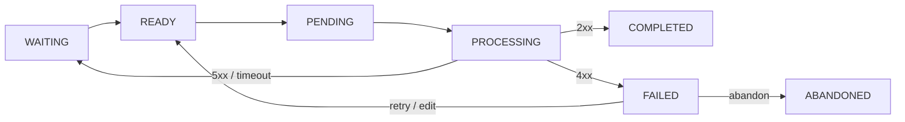

# request-insurance

[](https://github.com/cego/request-insurance/actions/workflows/quality-assurance.yml)

Guaranteed delivery of outbound HTTP requests for Laravel.

Instead of firing an HTTP request and hoping it arrives, you *insure* it: the request is persisted
to the database first, then delivered asynchronously by a worker that retries with exponential
backoff, keeps a log of every attempt, and hands permanently failing requests to a human through a
built-in management UI where they can be inspected, edited (with peer approval), retried, or
abandoned.

Use it for requests that must not be lost when the receiving service is down, times out, or your
own process dies mid-request — webhooks, downstream service calls, third-party API writes.

## Supported versions

| Package version | PHP versions supported | Status |
|-----------------|------------------------|--------|
| ^1              | ^7.4, ^8.0             | Security and bug fixes only |
| ^2              | ^8.3                   | Security and bug fixes only |
| ^3              | ^8.3                   | Active development |

## Installation

```bash
composer require cego/request-insurance
```

The service provider is auto-discovered and the migrations load automatically — run them with
`php artisan migrate`. To tweak configuration, publish the config file:

```bash
php artisan vendor:publish --provider="Cego\RequestInsurance\RequestInsuranceServiceProvider"
```

## Creating requests

Build and persist a request with the fluent builder — this only writes a database row, delivery
happens asynchronously:

```php
use Cego\RequestInsurance\Models\RequestInsurance;

RequestInsurance::getBuilder()
    ->url('https://api.example.com/webhooks')
    ->method('post')
    ->payload(['event' => 'order.shipped', 'order_id' => 123])
    ->headers(['Authorization' => 'Bearer ' . $token])
    ->traceId($traceId)      // optional: correlation id, searchable in the UI
    ->priority(5)            // optional: zero-based, 0 is processed first
    ->timeoutMs(5000)        // optional: per-request timeout
    ->create();
```

## Processing

A long-lived worker polls for requests that are due and delivers them:

```bash
php artisan process:request-insurances
```

Run one or many — workers coordinate through row locking (`SELECT … FOR UPDATE SKIP LOCKED` on
MySQL 8+), pick requests in priority order, and process them in batches (`batchSize`, optionally
with concurrent HTTP via `concurrentHttpEnabled`).

### Lifecycle



| State | Meaning |
|-------|---------|
| `WAITING` | Waiting for its `retry_at` timestamp before becoming ready |
| `READY` | Ready for a worker to pick up (default state) |
| `PENDING` | Reserved by a worker, about to be processed |
| `PROCESSING` | Actively being sent |
| `COMPLETED` | Delivered with a successful response |
| `FAILED` | Received a response or timeout that requires human intervention |
| `ABANDONED` | Given up on — will never be processed again |

Server errors and timeouts are retried with exponential backoff (`retry_factor ^ attempts`
seconds, factor 2 by default, capped at `retry_cap`, 1 hour by default) up to
`maximumNumberOfRetries`. Client errors (4xx) fail immediately — resending the same request would
just fail again, so a human decides: edit it, retry it, or abandon it. Inconsistent outcomes
(e.g. the process died mid-request) fail by default but can be retried automatically via
`retryInconsistentDefault` or per request with `->retryInconsistentState()`.

### Maintenance

The package schedules its own housekeeping (offset per application so fleets do not thunder):

| Command | Cadence | Purpose |
|---------|---------|---------|
| `unlock:request-insurances` | every 5 min | Releases requests stuck in `PENDING` |
| `request-insurance:unstuck-processing` | every 10 min | Fails or readies requests stuck in `PROCESSING` |
| `clean:request-insurances` | every 10 min | Deletes `COMPLETED` rows older than `cleanUpKeepDays` |

## Encryption and masking

Sensitive parts of a request can be encrypted at rest and are shown masked in the UI:

```php
RequestInsurance::getBuilder()
    ->headers(['X-Api-Key' => $secret])
    ->encryptHeader('X-Api-Key')
    ->payload(['card' => $number])
    ->encryptPayloadField('card')
    ->create();
```

`Authorization` headers are always encrypted by default — see `fieldsToAutoEncrypt` in the config.

## Events

Hook into processing with standard Laravel event listeners:

| Event | Fired |
|-------|-------|
| `RequestBeforeProcess` | Before a request is sent |
| `RequestSuccessful` | On a 2xx response |
| `RequestClientError` | On a 4xx response |
| `RequestServerError` | On a 5xx response |
| `RequestFailed` | When a request transitions to `FAILED` |
| `RequestInconsistent` | When a request ends in an inconsistent state |

All live under `Cego\RequestInsurance\Events`.

## Management UI

The package ships a web UI at `/vendor/request-insurances` (route name
`request-insurances.index`) with automatic light/dark mode:

- Pipeline overview with live per-state counts and cursor pagination
- Filtering by trace id, url, date range, and state
- Bulk retry / abandon of selected requests
- Per-request inspection: payload, headers, timings, response, and the full attempt log
- Editing of failed requests (method, url, payload, headers, priority) gated behind
  four-eyes approval, with a diff view and an audit trail of applied edits

Protect the `/vendor` path with your application's own auth middleware — the package does not
impose any.

## Monitoring

JSON endpoints suitable for dashboards and alerting: `/vendor/request-insurances/load` (worker
load), `/monitor` (active/failed totals), and `/monitor_segmented` (per-state counts). If
[spatie/laravel-prometheus](https://github.com/spatie/laravel-prometheus) is installed, matching
Prometheus gauges are registered automatically.

## Development

```bash
vendor/bin/phpunit
vendor/bin/php-cs-fixer fix
```
